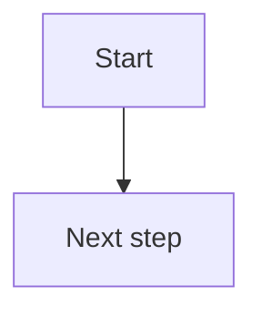
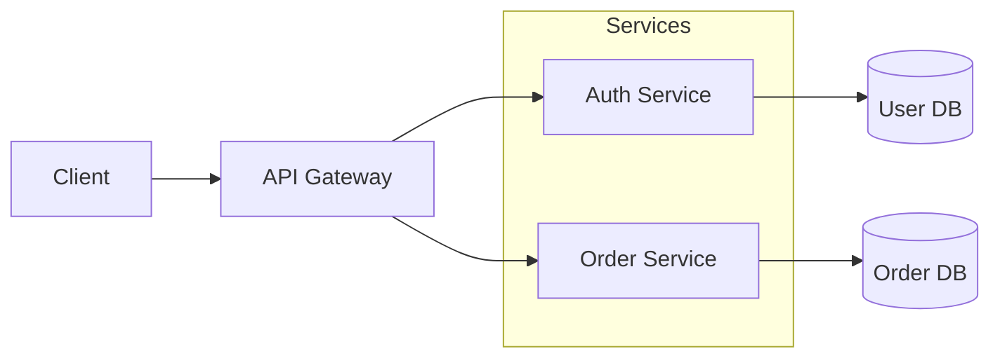
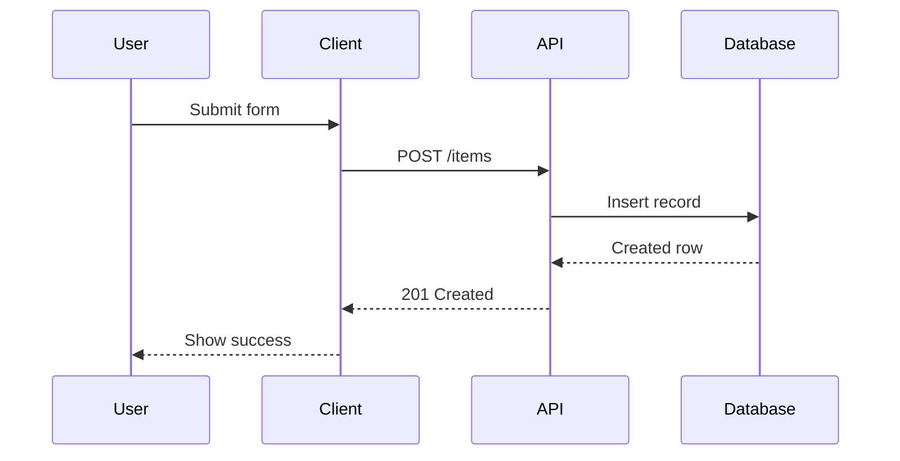
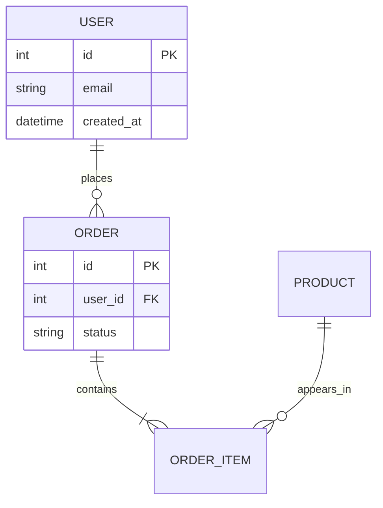
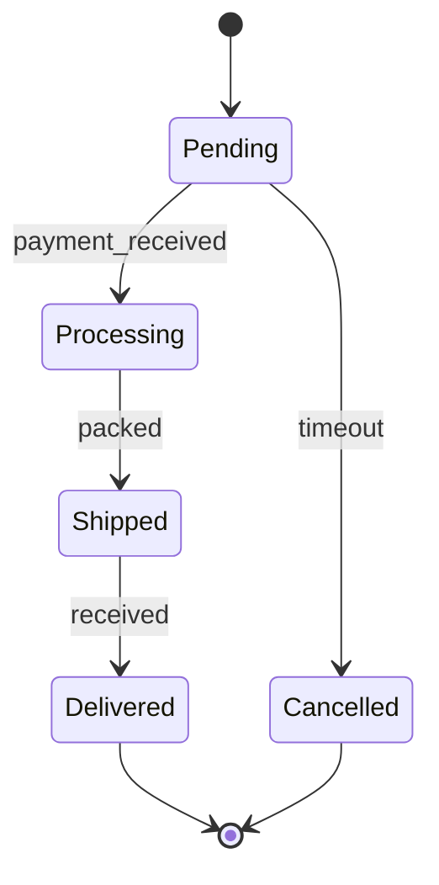

# Mermaid Markdown

Create Mermaid diagrams as Markdown fenced code blocks. Do not render images,
install CLI tools, call remote renderers, or create `.mmd` files unless the user
explicitly asks for that.

## Output

Return Mermaid in this form:

````markdown

````

When editing an existing Markdown document, update only the relevant
` ```mermaid ` fenced block unless nearby prose also needs to change.

## Workflow

1. Identify the diagram type that best matches the request.
2. Draft compact Mermaid source with clear node names and readable labels.
3. Check the syntax mentally before returning it.
4. Keep the diagram maintainable: prefer meaningful IDs, quoted labels where
   needed, and small subgraphs for related components.
5. When the user asks for changes, edit the existing Mermaid source instead of
   regenerating from scratch unless the structure is wrong.

## Diagram Choice

| Need | Mermaid type |
|---|---|
| Business flow, pipeline, architecture, dependency map | `flowchart TD` or `flowchart LR` |
| API calls, login flows, message passing | `sequenceDiagram` |
| Entity relationships and database tables | `erDiagram` |
| Object models and type relationships | `classDiagram` |
| Lifecycle, workflow states, finite-state behavior | `stateDiagram-v2` |
| Schedule or release plan | `gantt` |
| Git branch strategy | `gitGraph` |
| Topic breakdown | `mindmap` |
| User journey | `journey` |
| Simple proportions | `pie` |

Use `TD` for step-by-step vertical flows. Use `LR` for system architecture,
data flow, and diagrams that read better left-to-right.

## Syntax Rules

- Quote labels that contain punctuation, brackets, slashes, or colons:
  `A["POST /login: validate credentials"]`.
- Keep node IDs simple: letters, numbers, and underscores are safest.
- Use `subgraph "Name"` for grouped areas with spaces in the title.
- In sequence diagrams, declare participants first and in left-to-right order.
- Use `->>` for sequence requests and `-->>` for sequence responses.
- For long labels, use `<br/>` or shorter wording instead of wide text.
- Prefer explicit branches over dense edge labels when a decision has more than
  two outcomes.

## Flowchart Template



## Sequence Template



## ER Template



## State Template



## Review Checklist

Before returning the diagram, check:

- The chosen diagram type matches the user's intent.
- Every referenced node or participant is declared or obvious.
- Labels with special characters are quoted.
- Direction (`TD` or `LR`) fits the amount and shape of information.
- The diagram is small enough to read in Markdown preview.

If the diagram becomes too dense, split it into multiple Mermaid blocks instead
of forcing everything into one diagram.
